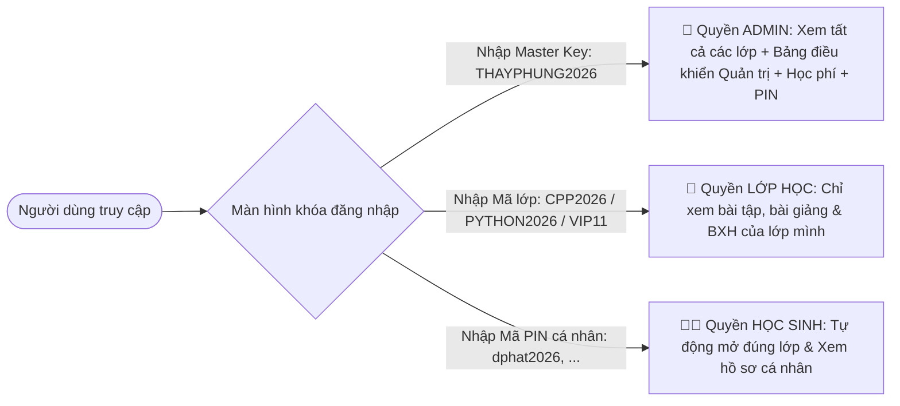

# 📘 BÁO CÁO TOÀN DIỆN VỀ HỆ THỐNG WEB HỌC TẬP & THI ĐẤU CHUYÊN TIN (WEBHOCTAP)

> **Dự án:** Web Quản Lý Học Tập, Thi Đấu Thuật Toán & Tiến Độ Học Sinh  
> **Nền tảng triển khai:** GitHub Pages (Serverless Web Architecture)  
> **Mã nguồn:** `D:\0.CP\WebHocTap` | **Remote:** `https://github.com/ducphung3103/WebHocTap.git`  
> **Phiên bản:** 2.0 (Hỗ trợ Admin GUI, Quản lý học phí, Phân lập đa lớp, Heatmap cá nhân, Bảo mật SHA-256)

---

## 📑 MỤC LỤC
1. [Tổng Quan Kiến Trúc Hệ Thống](#1-tổng-quan-kiến-trúc-hệ-thống)
2. [Hệ Thống Phân Quyền & Bảo Mật Đa Tầng](#2-hệ-thống-phân-quyền--bảo-mật-đa-tầng)
3. [Chi Tiết Các Tính Năng & Giao Diện Người Dùng](#3-chi-tiết-các-tính-năng--giao-diện-người-dùng)
   - [3.1. Bảng Xếp Hạng & Tiến Độ Lớp Học](#31-bảng-xếp-hạng--tiến-độ-lớp-học)
   - [3.2. Bảng Điểm Chi Tiết (Matrix Scoreboard)](#32-bảng-điểm-chi-tiết-matrix-scoreboard)
   - [3.3. Đấu Trường & Kỳ Thi (Contests)](#33-đấu-trường--kỳ-thi-contests)
   - [3.4. Kho Bài Tập Phân Loại Theo Lớp](#34-kho-bài-tập-phân-loại-theo-lớp)
   - [3.5. Trung Tâm Bài Giảng & Lý Thuyết (Notion LMS)](#35-trung-tâm-bài-giảng--lý-thuyết-notion-lms)
   - [3.6. Trang Hồ Sơ Cá Nhân & Heatmap Đóng Góp (`student.html`)](#36-trang-hồ-sơ-cá-nhân--heatmap-đóng-góp-studenthtml)
4. [Bảng Điều Khiển Quản Trị Hệ Thống (Admin GUI)](#4-bảng-điều-khiển-quản-trị-hệ-thống-admin-gui)
   - [4.1. Quản lý Học sinh & Tình trạng học tập](#41-quản-lý-học-sinh--tình-trạng-học-tập)
   - [4.2. Quản lý Điểm danh Học phí từng tháng](#42-quản-lý-điểm-danh-học-phí-từng-tháng)
   - [4.3. Quản lý Bài giảng & Kho học liệu](#43-quản-lý-bài-giảng--kho-học-liệu)
   - [4.4. Quản lý Kho Bài tập & Phân lớp áp dụng](#44-quản-lý-kho-bài-tập--phân-lớp-áp-dụng)
   - [4.5. Xuất dữ liệu Excel (.xlsx) & Khôi phục bộ nhớ đệm](#45-xuất-dữ-liệu-excel-xlsx--khôi-phục-bộ-nhớ-đệm)
5. [Cấu Trúc File Excel Trung Tâm (`Quản lý học sinh.xlsx`)](#5-cấu-trúc-file-excel-trung-tâm-quản-lý-học-sinhxlsx)
6. [Quy Trình Đồng Bộ & Vận Hành (1-Click Sync)](#6-quy-trình-đồng-bộ--vận-hành-1-click-sync)
7. [Bảng Tra Cứu Mã Truy Cập & Mật Khẩu](#7-bảng-tra-cứu-mã-truy-cập--mật-khẩu)

---

## 1. TỔNG QUAN KIẾN TRÚC HỆ THỐNG

Hệ thống được thiết kế theo mô hình **Serverless Static Web + Local Client State + Data-Driven Automation**:
- **Hosting & Phân phối:** Host trực tiếp trên GitHub Pages qua thư mục `docs/`. Trang load siêu nhanh, không tốn chi phí thuê máy chủ (VPS/Database).
- **Frontend Stack:** HTML5 hiện đại, TailwindCSS (CDN), JavaScript ES6+ (Native, không phụ thuộc framework cồng kềnh), thư viện **SheetJS (xlsx.full.min.js)** để xử lý đọc/ghi Excel trực tiếp trên trình duyệt.
- **Backend Data Engine:** Python 3 (`src/sync_excel.py`) sử dụng `openpyxl`, `hashlib` để xử lý dữ liệu từ file Excel, cào tiến độ nộp bài từ các Online Judge và biên dịch thành tệp dữ liệu tối ưu `docs/data.json`.
- **Cơ chế lưu trữ:**
  - *Dữ liệu chính thức:* `docs/data.json` (được commit lên GitHub để phục vụ web tĩnh).
  - *Bộ nhớ tạm thời Admin:* Trình duyệt lưu vào `localStorage` (`cp_app_data`) để phản hồi tức thì khi thao tác trên GUI.
  - *File gốc tuyệt mật:* `Quản lý học sinh.xlsx` đặt tại máy tính cá nhân của giáo viên.

```mermaid
flowchart TD
    Excel["Quản lý học sinh.xlsx (Tại máy Giáo viên)"] -->|sync.bat / sync_excel.py| JSON["docs/data.json (Mã hóa SHA-256)"]
    JSON -->|Git Push| GHPages["GitHub Pages (Web Trực Tuyến)"]
    GHPages --> Browser["Trình duyệt (Học sinh & Giáo viên)"]
    Browser -->|Thao tác trên GUI Admin| LocalStorage["Trình duyệt: localStorage"]
    LocalStorage -->|Nút 'Xuất File Excel' (SheetJS)| ExportExcel["Tải về file .xlsx cập nhật"]
    ExportExcel -->|Lưu đè| Excel
```

---

## 2. HỆ THỐNG PHÂN QUYỀN & BẢO MẬT ĐA TẦNG

Để đảm bảo học sinh không xem được dữ liệu của lớp khác, người ngoài không thể truy cập trái phép và bảo vệ tuyệt đối học phí/thông tin riêng tư:



### Các nguyên tắc bảo mật cốt lõi:
1. **Lưu trữ & Xác thực qua Firebase Realtime Database (Chống rò rỉ tuyệt đối):**
   - Mật khẩu admin, mật khẩu lớp và mã PIN của học sinh **tuyệt đối không lưu trong file `docs/data.json`**.
   - Toàn bộ mã PIN và token được chuyển sang lưu trữ trên **Firebase Realtime Database** dưới dạng mã băm SHA-256 (`/auth_tokens/{hash}`).
   - **Quy tắc bảo mật Firebase (Security Rules):** Thiết lập `.read: false` trên toàn bộ nút `auth_tokens` (chặn liệt kê, crawl toàn bộ token), chỉ cho phép truy vấn đơn lẻ `$tokenHash` (`.read: true`). Trình duyệt người dùng khi nhập mã PIN sẽ băm SHA-256 rồi gửi yêu cầu kiểm tra token tương ứng. Người ngoài hoặc học sinh khác không thể nào quét hoặc lấy trộm mã PIN của nhau.
2. **Cô lập File Excel Master & Google Sheets:**
   - File `Quản lý học sinh.xlsx` chứa đầy đủ họ tên, tài khoản và học phí được khai báo trong `.gitignore`. File này tuyệt đối không bao giờ bị đẩy lên GitHub.
   - Script tự động đồng bộ (`sync_gsheets.py`, `sync_excel.py`) tự động lọc bỏ toàn bộ trường PIN trước khi xuất file `docs/data.json`.
3. **Phân lập không gian lớp học:**
   - Học sinh lớp C++ khi đăng nhập sẽ chỉ thấy nội dung dành cho lớp C++. Tab bài tập, bài giảng và bảng xếp hạng tự động lọc và khóa các nội dung của lớp Python hay Python 1-1.
4. **Bảo vệ quyền Admin:**
   - Tab `👑 Quản Trị Hệ Thống` và các thông tin học phí hoàn toàn ẩn khỏi mã hiển thị thông thường, chỉ kích hoạt khi người dùng xác thực thành công vai trò `admin`.

---

## 3. CHI TIẾT CÁC TÍNH NĂNG & GIAO DIỆN NGƯỜI DÙNG

### 3.1. Bảng Xếp Hạng & Tiến Độ Lớp Học
- **Giao diện tinh gọn:** Bảng xếp hạng hiển thị thứ hạng, Họ và tên, Lớp học, Tổng số bài đã làm (Tổng AC trên tất cả các sàn), Thanh tiến độ bài tập mục tiêu theo lớp, Rating Contest và Danh hiệu thi đấu.
- **Tiến độ bài tập phân theo từng lớp:**
  - Mỗi lớp có số lượng bài tập mục tiêu khác nhau (Ví dụ: Lớp C++ có 8 bài, Lớp Python có bài tập riêng).
  - Thanh phần trăm tiến độ được tính dựa trên số bài mục tiêu mà học sinh đã hoàn thành so với tổng số bài được giao cho lớp đó:
    $$\text{Tiến độ (\%)} = \frac{\text{Số bài mục tiêu đã AC}}{\text{Tổng số bài của lớp}} \times 100$$
- **Rating Contest:**
  - Khởi tạo ban đầu là `0` với danh hiệu khởi điểm là `Newbie`.
  - Được cập nhật sau mỗi kỳ contest nội bộ.

### 3.2. Bảng Điểm Chi Tiết (Matrix Scoreboard)
- Nhấp vào nút **`Xem bảng điểm`** ở góc phải Bảng xếp hạng để mở ma trận điểm AC chi tiết.
- Ma trận thể hiện từng học sinh (hàng ngang) và từng bài tập mục tiêu (cột dọc):
  - Ô xanh lá kèm icon `✓`: Học sinh đã giải thành công (AC).
  - Ô xám mờ `-`: Học sinh chưa giải.
- Giúp giáo viên và học sinh nắm bắt ngay bài nào lớp đã làm tốt, bài nào nhiều bạn còn vướng.

### 3.3. Đấu Trường & Kỳ Thi (Contests)
- **Lịch thi đấu & Đếm ngược:**
  - Thẻ thông tin contest với đồng hồ đếm ngược thời gian thực (`Ngày : Giờ : Phút : Giây`) đến khi bắt đầu hoặc kết thúc kỳ thi.
  - Trạng thái trực quan: `🔴 Sắp diễn ra`, `🟢 Đang diễn ra`, `⚪ Đã kết thúc`.
- **Bảng theo dõi AC trong kỳ thi:**
  - Theo dõi danh sách học sinh tham gia và xem được bạn nào đã AC những bài nào cụ thể trong contest.

### 3.4. Kho Bài Tập Phân Loại Theo Lớp
- **Tên nền tảng chuẩn hóa:** Chỉ hiển thị tên ngắn gọn: `MarisaOJ`, `Codeforces`, `VJudge`.
- **Bộ lọc thông minh:** Lọc theo Lớp học (`C++`, `Python`, `Python 1-1`), theo Nền tảng và tìm kiếm theo tên/mã bài.
- **Thẻ độ khó & Dạng bài:** Phân loại rõ ràng (Level 1, Brute Force, Tham lam, Quy hoạch động, Đồ thị...).

### 3.5. Trung Tâm Bài Giảng & Lý Thuyết (Notion LMS)
- Hiển thị danh mục bài giảng sắp xếp theo tuần và chuyên đề.
- **Liên kết Notion:** Mỗi bài giảng có nút mở trực tiếp tài liệu hướng dẫn và lý thuyết trên Notion.
- **Phân quyền lớp học:** Chỉ những lớp được phân công mới nhìn thấy bài giảng tương ứng.

### 3.6. Trang Hồ Sơ Cá Nhân & Heatmap Đóng Góp (`student.html`)
Mỗi học sinh sở hữu một trang hồ sơ phân tích chuyên sâu (truy cập qua link `student.html?id=STT` hoặc nhấp vào tên học sinh trên BXH):
- **Thống kê giải bài đa khung thời gian:**
  - **Số bài trong tuần:** Đếm số bài AC trong 7 ngày gần nhất.
  - **Số bài trong tháng:** Đếm số bài AC trong 30 ngày gần nhất.
  - **Số bài trong năm:** Đếm số bài AC trong năm hiện tại.
  - **Tổng số bài giải:** Tổng số bài đã AC trên toàn bộ các nền tảng.
- **Biểu đồ nhiệt hoạt động (Activity Heatmap):**
  - Mô phỏng phong cách GitHub Heatmap với lưới 52 tuần (365 ngày).
  - Màu sắc ô thể hiện mức độ chăm chỉ luyện code (từ xám đậm $\rightarrow$ xanh lục nhạt $\rightarrow$ xanh lục đậm).
- **Hộp chuyển đổi học sinh nhanh:** Cho phép giáo viên chuyển qua lại giữa hồ sơ các em mà không cần quay lại trang chủ.

---

## 4. BẢNG ĐIỀU KHIỂN QUẢN TRỊ HỆ THỐNG (ADMIN GUI)

Được kích hoạt khi đăng nhập bằng mật khẩu Master `THAYPHUNG2026`. Bao gồm 4 phân hệ quản trị toàn diện:

### 4.1. Quản lý Học sinh & Tình trạng học tập
- **Bảng học sinh đầy đủ:** Hiển thị STT, Họ tên, Lớp học, Tình trạng, Mã PIN cá nhân, Handles thi đấu và Học phí.
- **Xem mã PIN cá nhân:** Mã PIN được che mặc định `••••••`. Bấm biểu tượng 👁️ để xem mã PIN đăng nhập của học sinh (để cấp cho phụ huynh/học sinh khi cần).
- **Thay đổi tình trạng học tập trực tiếp:** Dropdown cho phép chọn ngay tại chỗ:
  - `🟢 Đang học` (Hoạt động bình thường)
  - `🟡 Tạm dừng` (Nghỉ tạm thời)
  - `🔴 Bảo lưu` (Bảo lưu khóa học)
- **Thêm / Sửa / Xóa học sinh:**
  - Popup form cho phép chỉnh sửa Họ tên, đổi Lớp, cập nhật Handles (MarisaOJ, CF, VJudge) và đổi mã PIN.
  - Tự động băm lại mã PIN mới thành mã SHA-256 để học sinh có thể đăng nhập ngay.

### 4.2. Quản lý Điểm danh Học phí từng tháng
- **Cột học phí động:** Tự động tạo các cột theo từng tháng (ví dụ: `Tháng 9`, `Tháng 10`...).
- **Chuyển đổi trạng thái 1-Chạm:**
  - Nút bấm trực tiếp trên từng ô học phí của học sinh:
    - Bấm để chuyển sang `Đã đóng ✅` (huy hiệu màu xanh ngọc nổi bật).
    - Bấm để chuyển sang `Chưa đóng ⏳` (màu tối/đỏ).
- **Nút `+ Thêm tháng học phí`:** Cho phép giáo viên nhập thêm tháng mới (ví dụ: `Tháng 11`, `Tháng 12`) vào hệ thống chỉ với một hộp thoại nhập tên, không cần can thiệp code.

### 4.3. Quản lý Bài giảng & Kho học liệu
- Hiển thị danh sách toàn bộ bài giảng dưới dạng lưới thẻ.
- Hỗ trợ popup: Thêm bài giảng mới, Sửa tiêu đề, Link Notion, Tuần học, Tóm tắt và tích chọn các lớp được xem bài.
- Xóa bài giảng với cảnh báo xác nhận.

### 4.4. Quản lý Kho Bài tập & Phân lớp áp dụng
- Bảng danh mục bài tập luyện tập.
- Hỗ trợ thêm/sửa bài tập: Mã bài, Link đề bài, Nền tảng (*MarisaOJ*, *Codeforces*, *VJudge*), Độ khó, Dạng bài và tích chọn các lớp học cần làm bài này.

### 4.5. Xuất dữ liệu Excel (.xlsx) & Khôi phục bộ nhớ đệm
- **📥 Nút `Xuất File Excel Đồng Bộ`:**
  - Ứng dụng thư viện SheetJS, tổng hợp toàn bộ dữ liệu vừa chỉnh sửa (học sinh, học phí, bài tập, bài giảng) thành tệp `.xlsx` có đầy đủ 5 sheet chuẩn để thầy lưu về máy.
- **💾 Nút `Tải File data.json`:** Tải file dữ liệu JSON đã băm bảo mật.
- **🔄 Nút `Khôi Phục Từ Máy Chủ`:**
  - Dùng khi giáo viên vừa chạy script `sync.bat` trên máy tính và muốn trang web xóa bộ nhớ cache trình duyệt để nạp lại dữ liệu đồng bộ mới nhất từ server.

---

## 5. CẤU TRÚC FILE EXCEL TRUNG TÂM (`Quản lý học sinh.xlsx`)

File Excel gồm **5 Sheet nghiệp vụ** chuẩn hóa:

| Tên Sheet | Nội Dung & Cột | Mục Đích |
| :--- | :--- | :--- |
| **`Học Sinh`** | `STT`, `Họ và tên`, `Lớp`, `Tài khoản Marisaoj`, `Tài khoản Codeforces`, `Tài khoản Vjudge`, `Mã PIN cá nhân (Đăng nhập)`, `Trạng thái`, `Ghi chú` | Quản lý danh sách học viên, tài khoản thi đấu, PIN đăng nhập cá nhân và trạng thái học (`Đang học`, `Tạm dừng`, `Bảo lưu`). |
| **`Học Phí`** | `Họ và tên`, `Lớp`, `Tháng 9`, `Tháng 10`, `Tháng 11`, ... | Điểm danh học phí. Ô nào đánh dấu `x` là đã đóng, để trống là chưa đóng. |
| **`Bài Tập`** | `Mã bài`, `Link bài tập`, `Tên bài tập`, `Lớp áp dụng`, `Level`, `Dạng bài`, `Nền tảng`, `Ghi chú` | Danh mục bài tập được giao. Cột `Lớp áp dụng` ghi các lớp (ví dụ: `C++, Python` hoặc `Python 1-1`). |
| **`Bài Giảng`** | `Mã bài giảng`, `Chương / Tuần`, `Tiêu đề bài giảng`, `Lớp áp dụng`, `Link bài giảng / Notion`, `Tóm tắt kiến thức` | Danh mục bài giảng lý thuyết liên kết với Notion. |
| **`Cấu Hình Bảo Mật`** | `Tên Đối Tượng / Lớp`, `Cấp độ quyền`, `Mã truy cập / Mật khẩu`, `Mô tả phạm vi truy cập` | Quản lý mật khẩu Admin và mã truy cập chung của từng lớp. |

---

## 6. QUY TRÌNH ĐỒNG BỘ & VẬN HÀNH (1-CLICK SYNC)

Giáo viên có 2 phương thức vận hành linh hoạt tùy theo thói quen:

### Phương thức 1: Vận hành trực tiếp trên máy tính với `sync.bat` (Khuyên dùng)
1. Mở file `Quản lý học sinh.xlsx` trên máy tính và chỉnh sửa thông tin (thêm học sinh mới, tích `x` thu học phí, thêm link bài giảng Notion...).
2. Nhấn `Ctrl + S` để lưu file Excel.
3. Nhấp đúp chuột vào file `sync.bat` tại thư mục `D:\0.CP\WebHocTap`.
4. Script chạy ngầm các bước:
   - Đọc 5 sheet trong file Excel.
   - Băm SHA-256 các mật khẩu và mã PIN.
   - Quét và đối chiếu số lượng bài tập mục tiêu theo từng lớp.
   - Xuất ra file `docs/data.json` kèm mốc thời gian cập nhật.
   - Màn hình đen hiện thông báo hỏi: `Bạn có muốn tự động PUSH lên GitHub Pages không? (Y/N):`
5. Nhập phím `Y` rồi nhấn `Enter`. Toàn bộ dữ liệu web sẽ được đẩy lên GitHub Pages và cập nhật sau khoảng 30-60 giây!

### Phương thức 2: Vận hành trực tiếp trên giao diện Web (Admin GUI)
1. Truy cập web, đăng nhập mật khẩu Admin `THAYPHUNG2026`.
2. Vào tab `👑 Quản Trị Hệ Thống`:
   - Bấm trực tiếp vào các nút học phí để đổi `Đã đóng` / `Chưa đóng`.
   - Chọn dropdown để đổi tình trạng `🟢 Đang học` / `🟡 Tạm dừng` / `🔴 Bảo lưu`.
   - Nhấn `+ Thêm Học Sinh Mới`, `+ Thêm Bài Giảng`, hoặc `+ Thêm Bài Tập`.
3. Sau khi chỉnh sửa xong, vào mục **`💾 Hướng Dẫn & Xuất Dữ Liệu`**:
   - Nhấn nút **`📥 Xuất File Excel Đồng Bộ`** để tải file `.xlsx` về máy tính, lưu đè vào file `Quản lý học sinh.xlsx` để lưu trữ lâu dài.

---

## 7. BẢNG TRA CỨU MÃ TRUY CẬP & MẬT KHẨU

| Đối tượng | Cấp độ | Mã truy cập (Mật khẩu) | Phạm vi quyền hạn |
| :--- | :--- | :--- | :--- |
| **Giáo viên / Quản trị viên** | `ADMIN` | `THAYPHUNG2026` | Toàn quyền: Xem tất cả các lớp, mở mọi bài giảng, mở tab Admin, theo dõi học phí, quản lý học sinh và xuất Excel. |
| **Lớp C++** | `CLASS` | `CPP2026` | Xem bảng xếp hạng, bài tập và bài giảng của Lớp C++. |
| **Lớp Python** | `CLASS` | `PYTHON2026` | Xem bảng xếp hạng, bài tập và bài giảng của Lớp Python. |
| **Lớp Python 1-1** | `CLASS` | `VIP11` | Xem bảng xếp hạng, bài tập và bài giảng của Lớp Python 1-1. |
| **Học sinh cá nhân** | `STUDENT` | Mã PIN riêng từng em (vd: `dphat2026`, `minhkhoi2026`, ...) | Tự động vào lớp học tương ứng và mở trang hồ sơ tiến độ cá nhân của học sinh đó. |

---

## 8. DANH MỤC TẬP TIN DỰ ÁN

- `Quản lý học sinh.xlsx`: File Excel nguồn 5 sheet (bảo mật, không đưa lên git).
- `sync.bat`: Script 1-click tự động chạy Python sync và đẩy lên GitHub.
- `src/sync_excel.py`: Bộ máy đọc Excel, băm SHA-256 và sinh `data.json`.
- `docs/index.html`: Giao diện chính của hệ thống web (Leaderboard, Matrix, Contest, Bài tập, Bài giảng, Admin GUI).
- `docs/student.html`: Trang hồ sơ cá nhân và biểu đồ nhiệt Heatmap của học sinh.
- `docs/data.json`: Tệp dữ liệu trung tâm đã mã hóa được website đọc khi tải trang.
- `.gitignore`: Cấu hình bảo vệ file `.xlsx` và các thông tin nhạy cảm.

---
*Báo cáo được khởi tạo và lưu trữ tự động phục vụ công tác tra cứu, vận hành và nâng cấp hệ thống trong tương lai.*
