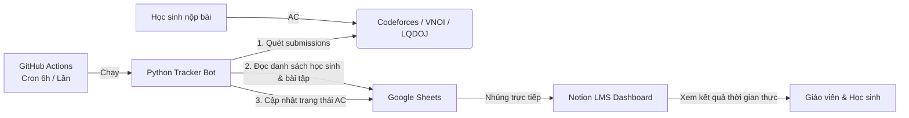

# 🚀 HỆ THỐNG QUẢN LÝ TIẾN ĐỘ HỌC LẬP TRÌNH THI ĐẤU (LMS 0 ĐỒNG)

Hệ thống quản lý lớp học và tự động theo dõi tiến độ nộp bài của học sinh trên các nền tảng lập trình trực tuyến (**Codeforces**, **VNOI**, **LQDOJ**) qua mô hình:
**Notion (Giao diện LMS & Bài giảng) + Google Sheets (Cơ sở dữ liệu) + Python Bot & GitHub Actions (Tự động hóa 24/7)**.

---

## 🏗 KIẾN TRÚC HỆ THỐNG (SYSTEM ARCHITECTURE)



---

## 📂 CẤU TRÚC THƯ MỤC DỰ ÁN

```
WebHocTap/
├── .github/
│   └── workflows/
│       └── auto_update.yml              # CI/CD GitHub Actions chạy tự động mỗi 6 giờ
├── config/
│   ├── __init__.py
│   └── settings.py                      # Quản lý cấu hình, giải mã Base64 / Secrets, an toàn SSL
├── src/
│   ├── core/
│   │   ├── models.py                    # Data models: Student, Problem, Platform, SyncReport
│   │   └── sync_service.py              # Xử lý delta updates và luồng đồng bộ
│   ├── crawlers/
│   │   ├── base.py                      # Base crawler với Rate limit, retry backoff, timeout
│   │   ├── codeforces.py                # Crawler Codeforces REST API
│   │   ├── vnoi.py                      # Crawler VNOI (DMOJ Accepted Submissions)
│   │   ├── lqdoj.py                     # Crawler LQDOJ (DMOJ Accepted Submissions)
│   │   └── registry.py                  # Registry quản lý các crawler theo nền tảng
│   ├── sheets/
│   │   ├── client.py                    # Google Sheets Client (gspread batch update)
│   │   └── mock_client.py               # Mock Sheets Client chạy offline bằng file CSV
│   └── utils/
│       └── logger.py                    # Logger định dạng chuẩn UTF-8 đa nền tảng
├── templates/
│   ├── notion/
│   │   ├── 01_workspace_structure.md    # Cấu trúc bố cục trang Notion LMS
│   │   ├── 02_student_database_schema.md# Schema Database Quản lý Học sinh
│   │   └── 03_problem_database_schema.md# Schema Database Kho Bài tập & Deadline
│   └── sheets/
│       ├── students_template.csv        # Mẫu Sheet 1: Danh sách học sinh
│       └── progress_template.csv        # Mẫu Sheet 2: Theo dõi bài tập
├── docs/
│   └── click_by_click_guide.md          # Hướng dẫn click chuột từ A đến Z (Google Cloud & GitHub)
├── main.py                              # CLI thực thi chính (hỗ trợ --dry-run, --mock, --check-handle)
├── requirements.txt                     # Danh sách thư viện Python
├── .env.example                         # File biến môi trường mẫu
└── .gitignore                           # Chặn lộ API keys, service_account.json
```

---

## ⚡ HƯỚNG DẪN CHẠY NHANH (QUICK START)

### 1. Cài đặt thư viện
```bash
pip install -r requirements.txt
```

### 2. Kiểm tra nhanh Crawler với 1 tài khoản (Test Handle)
```bash
# Kiểm tra Codeforces
python main.py --check-handle CF tourist

# Kiểm tra VNOI
python main.py --check-handle VNOI TAQUAN

# Kiểm tra LQDOJ
python main.py --check-handle LQDOJ tranvanphan17071987
```

### 3. Chạy thử nghiệm toàn bộ hệ thống bằng Mock Data (Không cần Google Cloud)
```bash
python main.py --mock
```

### 4. Chạy thực tế kết nối Google Sheets (Production)
Tạo file `.env` từ `.env.example`:
```ini
SPREADSHEET_ID=1BxiMVs0XRA5nFMdKvBdBZjgmUUqptlbs74OgvE2upms
GOOGLE_SERVICE_ACCOUNT_FILE=service_account.json
STUDENTS_SHEET_NAME=Danh sách Học sinh
PROGRESS_SHEET_NAME=Theo dõi Bài tập
```
Chạy lệnh đồng bộ:
```bash
python main.py
```
Hoặc chạy mô phỏng không ghi vào Sheets:
```bash
python main.py --dry-run
```

---

## 🌐 QUY TẮC ĐẶT TÊN MÃ BÀI TẬP TRÊN GOOGLE SHEETS
Để hệ thống nhận diện chính xác bài tập thuộc nền tảng nào:
- **Codeforces:** `CF-<Mã bài>` (Ví dụ: `CF-71A`, `CF-4A`, `CF-158B`)
- **VNOI:** `VNOI-<Mã bài>` (Ví dụ: `VNOI-nklineup`, `VNOI-liq`, `VNOI-post`)
- **LQDOJ:** `LQDOJ-<Mã bài>` (Ví dụ: `LQDOJ-cses1068`, `LQDOJ-cdl4p9`)
